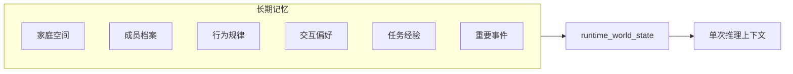

# 家庭机器人长期记忆设计

---

文档版本：v0.2
创建日期：2026-04-12
作者：Codex-VLN技术专家

文档变更记录：
- v0.3 | 2026-04-12 | Codex-VLN技术专家 | 补强“云侧交互大模型 + 端侧 NFM”协同口径，明确 `dialogue_memory_plane / embodied_memory_plane / runtime_world_state` 三层关系，并新增云侧交互大模型、端侧交互反射层、端侧 `NFM` 与 `world_state_memory` 的消费/写回矩阵。
- v0.2 | 2026-04-12 | Codex-VLN技术专家 | 对齐当前主线架构：将长期记忆设计映射到 `World State` 七实体与三层状态，明确 `world_state_memory` 是共享投影层而非唯一记忆源，并补充治理字段、消费方、写回方与 `provisional extension` 吸纳规则。

---

## 1. 文档定位

本文档描述的是导航相关长期记忆的研究分类，不替代当前主线的 `World State` 主文档。

当前主线下：

- `world_state_memory` 维护共享状态平面；
- 长期记忆可以由 Agent 应用团队与机器人主链协同维护；
- 研究文档需要说明导航侧、交互侧和共享状态之间的关系，而不是单独再定义一个脱离主线的“总记忆库”。

## 2. 上下文内、上下文外与共享状态

### 2.1 三层关系

本文统一使用三层表达：

1. `上下文内`
说明：单次推理窗口内直接可用的内容，如当前指令、当前感知和本轮检索结果。

2. `上下文外长期记忆`
说明：跨会话持久存在的结构化记忆，可按需被检索或投影；在系统协同上进一步分成：

- `dialogue_memory_plane`
- `embodied_memory_plane`

3. `runtime_world_state`
说明：当前任务和交互实际消费的共享状态投影，不等于全部长期记忆，也不等于唯一记忆源。

### 2.2 云侧交互大模型与端侧 `NFM` 的记忆协同

双脑协同下，长期记忆的更准确表达如下：

| 记忆平面 | 主要内容 | 主要消费者 | 主要写回方 |
| --- | --- | --- | --- |
| `dialogue_memory_plane` | 用户偏好、称呼、承诺、纠错、关系语义、澄清历史 | `cloud_interaction_model`、`multimodal_interaction` | `cloud_interaction_model`、`multimodal_interaction` |
| `embodied_memory_plane` | 家庭空间、物品位置、目标 belief、地图不一致、搜索经验 | `edge_nfm`、`decision_orchestration` | `edge_nfm`、`human_health_sensing` |
| `runtime_world_state` | 当前任务、当前人/物/风险状态、桥接状态投影 | `edge_nfm`、`edge_interaction_reflex`、`decision_orchestration` | `world_state_memory` |

这里要特别强调：

1. `cloud_interaction_model` 是长期记忆的正式协同对象。
2. `edge_nfm` 只消费与端侧导航相关的长期记忆。
3. `world_state_memory` 负责形成两侧共享投影，而不是变成某一侧的私有记忆库。

### 2.3 治理原则

- 原始敏感数据默认不出端；
- 结构化摘要、授权同步和最小必要信息按主线治理边界处理；
- 用户对长期记忆条目继续保有读、写、删权限；
- `runtime_world_state` 只消费必要投影，不直接暴露所有长期记忆原文。
- 云侧交互大模型可以在授权条件下消费结构化摘要和可治理的记忆结论，但不默认获得原始敏感数据。

## 3. 长期记忆优先级

优先级继续以“失去后的代价”为主要判断依据。

| 优先级 | 记忆类型 | 失去后的主要代价 |
| --- | --- | --- |
| `P1` | 家庭空间结构、成员档案 | 导航与画像判断失去基础锚点 |
| `P2` | 行为规律、物品位置先验、交互偏好 | 找人、找物与个性化交互明显退化 |
| `P3` | 任务经验与策略、重要事件与承诺 | 效率和信任感下降，但系统仍可工作 |

## 4. 六类长期记忆

### 4.1 家庭空间记忆

用于支撑导航任务不必每次从零探索，包含：

- 房间拓扑与连通关系；
- 功能区划分；
- 家具位置；
- 常见物品默认位置与取用频率；
- 禁入区、风险区、地标。

### 4.2 成员档案

用于支撑差异化判断，包含：

- 身份与角色；
- 权限级别；
- 健康约束；
- 个体偏好与默认位置。

### 4.3 行为 / 活动规律

用于支撑找人、共存移动与异常检测，包含：

- 时段到房间的概率分布；
- 足以定义“什么算异常”的历史基准。

### 4.4 交互偏好

用于支撑交互表达与主动打扰边界，包含：

- 音量、语速、接近距离；
- 免打扰时段；
- 称呼与表达风格。

### 4.5 任务经验与策略

用于支撑同类任务复用，包含：

- 成功路径关键节点；
- 首次失败点与失败原因；
- 不同策略在同类任务上的相对效果。

### 4.6 重要事件与承诺

用于支撑后续判断与交互一致性，包含：

- 用户纠错；
- 重要说明与承诺；
- 偏好表达；
- 明确拒绝与安全相关说明。

## 5. 与七实体和三层状态的映射

### 5.1 `memory_entity_mapping`

| 记忆类型 | 七实体映射 | 三层状态位置 | 说明 |
| --- | --- | --- | --- |
| 家庭空间记忆 | `Place / Object` | `persistent_state` + `semantic_global_frame` | 空间拓扑、家具、物品先验优先落在现有实体 |
| 成员档案 | `Person / CareRelationship / Household` | `persistent_state` | 画像、权限、关系与健康约束 |
| 行为规律 | `Person + Place` 的统计子结构 | `persistent_state`，按需投影到 `session_state` | 用于找人先验与异常偏离基准 |
| 交互偏好 | `Person.interaction_preferences` | `persistent_state`，按需投影到 `session_state` | 不单独新增顶层实体 |
| 任务经验与策略 | `Task` 的经验子结构 | `persistent_state` + `session_state` | 若超出当前 `Task` 字段，自下而上标记为 `provisional extension` |
| 重要事件与承诺 | `CareEvent / Task / Person` | `persistent_state`，按需投影 | 规则性结论、状态性结论与任务结果分开治理 |

### 5.2 吸纳规则

若研究文档提到但七实体未显式命名的内容，处理顺序固定为：

1. 优先吸收到现有实体子结构；
2. 若只是任务期上下文，优先进入 `session_state`；
3. 只有在跨模块稳定复用且无法自然落入现有实体时，才标记为 `provisional extension`。

## 6. 治理字段与衰减规则

长期记忆写入共享状态平面时，至少要显式维护：

- `source`
- `confidence`
- `privacy_level`
- `freshness`
- `decay_policy`

建议规则如下：

| 规则 | 说明 |
| --- | --- |
| `source` | 标记来源于端侧感知、用户确认、远程确认还是云侧结构化同步 |
| `confidence` | 表示当前记忆可信程度 |
| `privacy_level` | 决定出端、同步和访问控制边界 |
| `freshness` | 决定当前记忆是否仍应被优先消费 |
| `decay_policy` | 决定按时间、负反馈还是结构变化触发衰减 |

## 7. 消费、写回与治理权

### 7.1 消费方

| 消费方                      | 主要消费记忆              | 说明                         |
| ------------------------ | ------------------- | -------------------------- |
| `NFM`                    | 家庭空间、物品位置、行为规律、任务经验 | 只消费与端侧导航相关的长期记忆              |
| `cloud_interaction_model`| 成员档案、交互偏好、重要事件      | 用于个性化表达、澄清与对话一致性           |
| `edge_interaction_reflex`| `runtime_world_state` 的必要投影 | 用于低时延唤醒回应、短句安抚与边运动边表达 |
| `world_state_memory`     | 全类型记忆的必要投影          | 负责形成 `runtime_world_state` |
| `decision_orchestration` | 任务经验、重要事件、成员约束      | 用于任务分解和恢复                  |
| `human_health_sensing`   | 成员档案（健康字段）、行为规律     | 用于异常检测与候选事件生成              |

### 7.2 写回方

| 写回方                      | 主要写回内容                       |
| ------------------------ | ---------------------------- |
| `NFM`                    | 搜索结果、位置观测、地图不一致、目标 belief 更新 |
| `cloud_interaction_model`| 用户纠错、偏好表达、承诺性结论              |
| `edge_interaction_reflex`| 低时延交互状态、即时打断/回应结果            |
| `decision_orchestration` | 任务结果、步骤状态、失败分类               |
| `human_health_sensing`   | 健康候选事件、行为偏离观测                |

### 7.3 治理权

- `world_state_memory` 拥有共享投影与一致性治理权；
- Agent 应用团队与机器人主链可协同维护长期记忆，但必须通过主线治理规则写入；
- `world_state_memory` 是共享投影层，不是唯一记忆源。

## 8. 与 `PDCP` 的关系

`PDCP` 评审不冻结本文的完整记忆实现，只关注：

1. 六类长期记忆是否已映射到七实体与三层状态；
2. 是否与 `runtime_world_state` 的角色一致；
3. 是否把治理字段、衰减规则和访问边界写清楚；
4. 是否避免新建脱离主线的“第二套记忆体系”。
