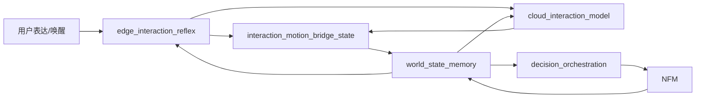

# 家庭机器人长程任务设计

---

文档版本：v0.2
创建日期：2026-04-12
作者：Codex-VLN技术专家

文档变更记录：
- v0.3 | 2026-04-12 | Codex-VLN技术专家 | 补强“云侧交互大模型 -> 桥接状态 -> 端侧 NFM”的长程任务链路，明确 `cloud_interaction_model / edge_interaction_reflex / NFM` 的分工，并区分交互触发与即时回应的来源。
- v0.2 | 2026-04-12 | Codex-VLN技术专家 | 对齐当前主线架构：将研究执行器统一映射到当前 `9` 个一级模块，把长程任务重写为 `decision_orchestration + world_state_memory` 承接的任务上下文，并将异常升级改写为审批前的接口位。

---

## 1. 文档定位

本文档描述的是长程任务的研究抽象，不是新的产品状态机，也不是新的一级模块设计。

当前主线下，长程任务应理解为：

- 由 `decision_orchestration` 维护任务分解、推进与恢复；
- 由 `world_state_memory` 承接任务状态的持久化与共享状态投影；
- 由 `multimodal_interaction`、`human_health_sensing`、`mobility_navigation / NFM`、`companion_service_system` 等模块消费并执行具体子步骤。

## 2. 研究术语与主线模块映射

为避免形成“双系统定义”，本文统一采用下表：

| 研究术语 | 主线承接模块 | 说明 |
| --- | --- | --- |
| 任务规划器 | `decision_orchestration` | 负责子任务拆解、顺序管理、恢复策略 |
| 主动提醒调度器 | `companion_service_system + decision_orchestration` | 负责时间类触发与结构化计划任务下发 |
| 健康监测 Agent | `human_health_sensing + decision_orchestration` | 负责健康候选事件生成与升级前编排 |
| 云侧交互大模型 | `cloud_interaction_model`（研究协同对象）+ `multimodal_interaction`（产品承接位） | 负责复杂提醒、确认、澄清与个性化表达 |
| 端侧交互反射层 | `edge_interaction_reflex`（研究协同对象）+ `multimodal_interaction`（产品承接位） | 负责低时延唤醒回应和边运动边表达 |
| `VLN` 导航模块 | `NFM` 或 `semantic_navigation_policy / social_mobility_policy` | 负责导航子步骤、搜索、跟随和共存移动 |

## 3. 长程任务类型

长程任务的定义保持不变：任务跨越多个步骤或时间段，需要持久化状态、有条件分支，或可被中断后恢复。

但在当前主线下，主要执行器应改写为“能力承接组合”：

| 类型 | 家庭场景示例 | 能力承接组合 | 依赖记忆 |
| --- | --- | --- | --- |
| 跨步骤复合任务 | 去药盒已知位置确认 -> 找爷爷 -> 提醒服药 | `decision_orchestration + multimodal_interaction + NFM` | 家庭空间记忆 + 成员档案 |
| 等待触发任务 | 爷爷午睡醒来后提醒服药 | `companion_service_system + decision_orchestration + multimodal_interaction + NFM` | 行为规律 + 任务状态记忆 |
| 周期性任务 | 每周一次全屋安全巡视 | `companion_service_system + decision_orchestration + NFM` | 任务状态记忆 + 成员档案 |
| 健康监测与异常升级 | 1 小时内无移动则检查 | `human_health_sensing + decision_orchestration + NFM + multimodal_interaction` | 成员档案 + 行为规律 |
| 长期护理计划 | 康复期每天两次陪同做康复运动 | `decision_orchestration + multimodal_interaction + NFM` | 成员档案 + 任务经验 + 重要事件 |
| 环境维护任务 | 每日全屋扫描更新物品位置先验 | `decision_orchestration + NFM + world_state_memory` | 家庭空间记忆 + 任务状态记忆 |

## 3.1 交互触发任务的协同路径

对由语言触发的长程任务，当前研究计划应统一采用下面这条链：

统一链路说明：

1. 用户完成唤醒后，`edge_interaction_reflex` 先做出首字响应，保障首响应体验；
2. 在云侧结果返回前，`edge_interaction_reflex` 可先通过 `interaction_motion_bridge_state` 驱动 `social_mobility_policy`，完成转向、正对、轻微接近或停等即时运动调整；
3. `cloud_interaction_model` 再完成更完整的意图提炼与澄清生成；
4. 输出结构化 `task_intent / clarification_context / narration_policy`；
5. 经桥接状态写入 `world_state`；
6. 由 `decision_orchestration` 与 `NFM` 承接导航子步骤；
7. 导航进展、失败、澄清需求和礼让状态再回流给云侧交互大模型与端侧反射层。

## 4. 任务状态持久化

长程任务不是新的顶层状态机，而是跨多个业务主状态持续存在的任务上下文。

当前主线下，建议由 `world_state_memory` 承接 `task_state_record`：

| 字段 | 说明 |
| --- | --- |
| `task_id` | 跨会话唯一标识 |
| `task_type` | 复合 / 等待触发 / 周期 / 健康监测 / 环境维护 |
| `owner_module` | 当前主要编排者，通常为 `decision_orchestration` |
| `linked_business_state` | 当前关联的业务主状态 |
| `current_stage` | 当前执行到的步骤 |
| `step_graph` | 步骤定义、依赖关系和前置条件 |
| `step_results` | 已完成步骤的结构化结果 |
| `wait_condition` | 等待触发条件 |
| `resume_point` | 恢复起点 |
| `timeout_policy` | 超时后的候选动作 |
| `current_status` | 待执行 / 执行中 / 等待 / 已完成 / 已挂起 |
| `related_person_ids` | 相关人员 |

持久化原则：

- 每步执行结果写回后，才允许推进下一步；
- 断电或重启后，从最后已确认写回的步骤继续；
- 任务状态是 `world_state_memory` 的一部分，不应悬空于主线状态平面之外。

## 5. 等待与触发条件

等待与触发条件需要映射到当前模块和 `World State` 事件源：

| 触发条件类型 | 当前主线评估主体 | 典型来源 |
| --- | --- | --- |
| 时间点触发 | `companion_service_system + decision_orchestration` | 计划任务、周期任务 |
| 人员状态触发 | `human_health_sensing + NFM + world_state_memory` | 人员位置、起床、离床、进入房间 |
| 健康事件触发 | `human_health_sensing + decision_orchestration` | 血压异常、无移动、服药未确认 |
| 传感器事件触发 | `platform_runtime + world_state_memory + decision_orchestration` | 门磁、燃气、水渍等 |
| 另一任务完成触发 | `decision_orchestration` | 上一步完成、条件满足 |
| 交互触发 | `cloud_interaction_model + multimodal_interaction + world_state_memory` | 用户确认、用户取消、用户补充线索 |
| 即时回应触发 | `edge_interaction_reflex + world_state_memory` | 唤醒回应、短句安抚、边运动边播报 |

评估策略：

- 健康/安全类触发优先级最高，不得因算力竞争降级；
- 所有触发都应先更新 `runtime_world_state`，再由编排层决定是否推进任务。

## 6. 中断恢复与异常升级

### 6.1 中断恢复

| 中断类型 | 触发条件 | 恢复策略 |
| --- | --- | --- |
| 断电 / 重启 | 系统非预期关机 | 读取 `task_state_record`，从 `resume_point` 继续 |
| 用户主动中断 | 用户说“先不用了” | 任务设为挂起，保留供后续恢复 |
| 子步骤失败 | 导航失败、目标未找到、对话无应答 | 重试（不超过上限）或跳转备选步骤 |
| 超时 | 超过预设超时时间 | 生成 `escalation_candidate` 或失败结果，不直接触发外部动作 |
| 高优先级任务抢占 | 安全事件或紧急指令 | 当前任务挂起，高优先级任务完成后恢复 |
| 能力降级 | `NFM`、交互、感知链部分失效 | 仅保留可用子步骤，或进入降级模式 |

### 6.2 异常升级接口位

“异常升级”在本文中保留为研究接口位，但进入产品链时必须经过主线审批接口。

建议统一使用：

- `escalation_hook`：当前任务预留的升级接口
- `escalation_candidate`：由任务上下文生成的待审批升级候选

进入产品链的路径固定为：

`任务超时 / 任务失败 / 风险升高 -> escalation_candidate -> ActionProposal -> ApprovalDecision -> 异常升级状态或其他批准动作`

因此本文不再直接写：

- 立即通知家属
- 直接转人工
- 绕过审批链的升级动作

补充说明：

- 云侧交互大模型只生成任务候选、澄清建议和表达内容；
- 它不直接替代 `ActionProposal / ApprovalDecision`；
- 端侧即时回应同样不能旁路产品审批链去触发高风险动作。

## 7. 记忆对长程任务的支持关系

长程任务消费长期记忆，但当前主线下这些记忆必须通过 `world_state_memory` 或共享状态平面进入任务编排链：

| 阶段 | 依赖记忆 | 用途 |
| --- | --- | --- |
| 任务规划前 | 家庭空间 + 成员档案 + 行为规律 + 重要事件 + 任务状态记忆 | 推断子步骤内容、顺序和约束 |
| 执行中 | 任务状态记忆 + 家庭空间 + 行为规律 + 交互偏好 | 决定当前子步骤策略与交互方式 |
| 执行后 | 任务结果、位置观测、行为观测、策略效果 | 更新共享状态与长期记忆 |

### 7.1 记忆消费者

| 消费者 | 主要消费记忆 | 长程任务中的职责 |
| --- | --- | --- |
| `decision_orchestration` | 全类型记忆 | 拆解子任务、管理执行顺序、协调执行模块 |
| `NFM / semantic_navigation_policy / social_mobility_policy` | 家庭空间、行为规律、任务经验 | 执行导航与共存移动子步骤 |
| `cloud_interaction_model + multimodal_interaction` | 成员档案、交互偏好、重要事件 | 执行复杂提醒、确认、澄清和表达 |
| `edge_interaction_reflex + multimodal_interaction` | `runtime_world_state` 的必要投影 | 执行低时延播报、边运动边表达和降级交互 |
| `human_health_sensing` | 成员档案（健康字段）、行为规律 | 生成健康候选事件 |
| `companion_service_system` | 计划任务、记忆治理结果、远程确认结果 | 提供时间触发和结构化外部输入 |

## 8. 与 `PDCP` 的关系

`PDCP` 评审不冻结本文里的长期护理计划或复杂任务闭环本身，而只评估：

1. 长程任务设计是否能落在当前 `9` 个一级模块上；
2. 是否能通过 `world_state_memory` 承接任务状态；
3. 是否把“异常升级”正确收敛成接口位与审批前候选；
4. 是否与当前状态机、审批接口和业务主状态不冲突。
