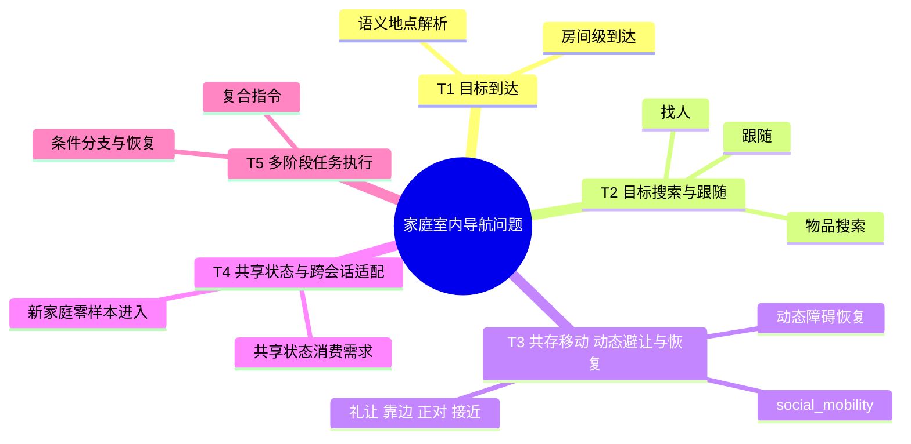

# 家庭机器人导航基础问题定义与数据设计

---

文档版本：v0.2
创建日期：2026-04-12
作者：Codex-VLN技术专家

文档变更记录：
- v0.3 | 2026-04-12 | Codex-VLN技术专家 | 补强“云侧交互大模型 + 端侧 NFM”协同口径：保持云侧交互大模型不属于导航研究主体，同时明确其作为正式协同输入源，通过 `interaction_motion_bridge_state / task_intent / clarification_context / narration_policy` 影响端侧 `NFM`。
- v0.2 | 2026-04-12 | Codex-VLN技术专家 | 对齐当前主线架构：将 `world_state / world_state_memory` 改写为共享状态平面，引入 `social_mobility / 共存移动` 与 `交互-运动桥接状态`，补充与 `NFM`、接口面和 `PDCP` 放行口径的承接关系。

---

## 1. 文档定位

本文档是导航研究文档，不是主线架构冻结文档。

它只回答三件事：

1. 当前家庭机器人导航基础问题应该如何精简定义；
2. 导航侧为了完成这些问题，需要消费哪些共享状态与数据；
3. `PDCP` 评审时，应如何判断这些研究结论是否能承接主线架构交给导航侧的任务。

本文默认：

- `NFM` 只指端侧导航模型；
- `world_state / world_state_memory` 是共享状态平面，可由 Agent 应用团队与机器人主链协同维护；
- 本文不定义主线架构职责分工，只描述导航侧的研究边界与数据需求。

## 2. 边界与承接关系

### 2.1 研究边界

**在范围内**：

- 室内家庭场景的目标到达、物品搜索、找人、跟随、巡视和共存移动；
- 基于用户指令或结构化任务输入的导航决策；
- 空间语义理解、目标 belief、搜索恢复、粗粒度重定位、共享空间移动；
- 导航侧需要消费的共享状态、共享记忆与桥接状态；
- 支撑上述能力的数据规划、评测集设计和研究优先级。

**不在范围内**：

- 机械操作（抓取、开关门、递送）；
- 室外场景、商业空间、办公空间；
- 底层运动控制与执行器控制；
- 云侧交互大模型本身的能力设计；
- 主线架构中的审批、授权、异常升级主链；
- `PDCP` 阶段对完整训练 recipe、数据规模或前沿路线的冻结。

补充说明：

- 云侧交互大模型本身不属于导航研究主体；
- 但它是导航研究的正式协同输入源之一，主要通过结构化桥接状态影响 `NFM`。

### 2.2 与当前主线架构的承接关系

本文中的研究问题最终需要承接到以下主线对象：

| 研究对象 | 当前主线承接位 | 说明 |
| --- | --- | --- |
| 目标到达 / 搜索 / 跟随 | `semantic_navigation_policy` | 解决“去哪里、先看哪里、失败后怎么恢复” |
| 共存移动 / 礼让 / 主动 reposition | `social_mobility_policy` | 解决“在共享空间里怎么合适地动” |
| 跨会话空间与目标状态 | `runtime_world_state` + `semantic_global_frame` | 导航侧消费共享状态，不单独定义新的全局真值源 |
| 局部执行约束 | `local_metric_frame` | 导航侧读取局部几何、通行性和风险约束 |
| 边运动边交互状态 | `interaction_motion_bridge_state` | 由系统桥接层提供，导航侧只消费结构化状态 |

### 2.2.1 云侧交互大模型作为协同输入源

当前研究计划中，应把云侧交互大模型定义为“导航研究的协同输入源”，而不是“导航研究主体本身”。

它对端侧 `NFM` 的影响只应通过以下结构化对象进入：

- `interaction_motion_bridge_state`
- `task_intent`
- `clarification_context`
- `narration_policy`

因此本文坚持两条边界：

1. `NFM` 不外延为“交互+导航”的统一大模型。
2. 导航侧不直接消费云侧长对话上下文，只消费桥接后的结构化输入。

### 2.3 系统层参考

本文使用的 `L2-L5` 仅作为研究层参考，不替代主线模块图：

| 层级 | 职责简述 |
| --- | --- |
| `L2` | 语义建模层：场景理解、目标识别、空间语义图 |
| `L3` | 决策层：任务规划、快慢推理、策略选择 |
| `L4` | 运动规划层：避障、路径优化、动态响应 |
| `L5` | 运动执行层：底层控制、几何导航 |

## 3. 问题概念定义

### 3.1 什么是“问题”

本文中的“问题”指：端侧 `NFM` 为完成家庭室内导航相关任务，必须解决的一类可独立研究、可独立验证、并能被当前主线接口消费的客观难题。

### 3.2 分类方式

问题仍按用户任务视角做一级分类，但要满足两个约束：

1. 保持精简，不把所有支撑能力膨胀成一级任务类；
2. 必须覆盖当前主线已经冻结的 `social_mobility` 与交互-运动桥接需求。

辅助维度保留为：

| 辅助维度 | 可选值 | 说明 |
| --- | --- | --- |
| 指令来源 | 用户直接 / 结构化任务输入 | 用户实时输入，或系统/应用层下发的结构化任务 |
| 环境状态 | 静态 / 动态 | 场景中是否存在移动人、宠物、临时障碍 |
| 风险等级 | 低风险 / 高风险 | 是否涉及老人、儿童、夜间、狭窄空间等敏感情境 |

### 3.3 核心概念

| 概念 | 定义 | 示例 |
| --- | --- | --- |
| `问题域` | 一组同类家庭场景任务难题的集合 | 目标搜索域、共存移动域 |
| `子问题` | 问题域内最小可独立研究和验证的技术单元 | 候选区域排序、地图漂移恢复 |
| `shared_state_dependency` | 导航侧必须消费的共享状态依赖 | `target_belief`、`speaker_lock`、`map_match_hypothesis` |
| `协同输入源` | 来自云侧交互大模型但以结构化形式进入导航侧的输入 | `task_intent`、`clarification_context` |
| `问题实例` | 子问题在具体场景配置下的可执行验证案例 | “书房场景找眼镜，Top-3 候选包含书桌” |

## 4. 家居室内导航问题分类

### 4.1 五类任务问题

### 4.2 各任务类问题与子问题

#### T1 目标到达

定义：给定房间名、区域描述或结构化目标，机器人在家庭环境中完成安全、可解释的目标到达。

| 子问题 | 定义 |
| --- | --- |
| `T1.1` | 语义地点解析：将自然语言或结构化位置描述映射到实际目标区域 |
| `T1.2` | 粗粒度全局锚定：基于 `semantic_global_frame` 建立当前任务起点与目标的语义关系 |

#### T2 目标搜索与跟随

定义：给定物品、人员或跟随对象，机器人在家庭环境中完成搜索、确认、靠近或持续跟随。

| 子问题 | 定义 |
| --- | --- |
| `T2.1` | 家庭语义先验建模：建立各类物品在家庭空间中的位置先验 |
| `T2.2` | 候选区域排序：按先验、历史状态和当前观测决定搜索顺序 |
| `T2.3` | 搜索失败恢复：预期位置未命中时调整策略并继续 |
| `T2.4` | 人员活动规律建模：形成找人先验和异常偏离基准 |
| `T2.5` | 实时人员定位：在缺乏位置先验时动态确定目标人员当前所在 |
| `T2.6` | 安全跟随：在动态环境中保持安全距离和持续可见性 |

#### T3 共存移动、动态避让与恢复

定义：机器人在无显式用户任务或正在执行任务时，在有老人、儿童、宠物和临时障碍物的家庭环境中完成合适、安全、低打扰的移动。

| 子问题 | 定义 |
| --- | --- |
| `T3.1` | `social_mobility`：礼让、靠边、等待、正对说话人、无显式任务下的接近与 reposition |
| `T3.2` | 移动人员安全间距：在老人、儿童附近通行时保持安全距离 |
| `T3.3` | 小体积动态障碍应对：识别并应对宠物、玩具等快速移动障碍 |
| `T3.4` | 临时障碍物恢复：家具移位、地面新物体、通道被堵时的安全恢复 |

#### T4 共享状态与跨会话适配

定义：导航侧如何消费共享状态平面中的长期空间信息、任务上下文和跨会话状态，并在需要时完成零样本进入与短时适配。

| 子问题 | 定义 |
| --- | --- |
| `T4A` | 导航侧对共享状态平面的消费需求：明确需要哪些结构化字段才能支撑搜索、跟随、恢复与记忆使用 |
| `T4B.1` | 新家庭零样本导航：在无预先建图的新家庭中完成基础位置到达 |
| `T4B.2` | Sim-to-Real 泛化验证：仿真训练到真实新家庭的性能保留 |

#### T5 多阶段任务执行

定义：执行含条件分支和恢复策略的多步导航相关任务，如“去药盒已知位置确认，若爷爷不在书房就去卧室找”。

### 4.3 通用支撑能力

以下能力为所有任务类提供共性支撑，但不再单独膨胀成新的一级任务类：

| 能力 | 支撑范围 | 要点 |
| --- | --- | --- |
| 快慢推理 | `T1-T5` | 低延迟快通道 + 高质量慢通道构成耦合反馈闭环 |
| 导航基础模型与快速适配 | `T1 / T4` | 大规模仿真预训练底座 + 小规模快速适配 |
| 主动感知 / 可见性管理 | `T2 / T3` | 主动调整视角，减少盲区导致的搜索失败 |
| 交互-运动桥接状态 | `T2 / T3 / T5` | 不是独立用户任务类，而是边运动边交互场景的共享支撑能力；导航侧只消费结构化桥接状态，不直接消费云侧长对话上下文 |

### 4.4 优先级

| 任务类 | 阶段优先级 | 依赖关系 |
| --- | --- | --- |
| `T1` 目标到达 | `P0` | 无前置 |
| `T2` 目标搜索与跟随 | `P0` | 依赖 `T4A` 的共享状态字段定义 |
| `T3` 共存移动、动态避让与恢复 | `P0` | 与 `T1/T2` 并行推进 |
| `T4A` 共享状态消费需求 | `P0` | 需在接口冻结前确认 |
| `T4B` 零样本进入与短时适配 | `P1` | 依赖仿真与真实对齐基础设施 |
| `T5` 多阶段任务执行 | `P2` | 前置：`T1-T4` 基础能力成熟 |

## 5. 数据规划

### 5.1 数据规划原则

问题驱动仍然成立，但推导链要对齐当前主线对象：

默认前提：

- 仿真场景库、真实采集规范、Sim-to-Real 验证共同构成数据基础设施；
- 原始敏感数据默认不出端；
- 结构化摘要、授权同步和最小必要信息遵循当前主线治理边界。

### 5.2 共享状态依赖（支撑 `T4A`）

`T4A` 不再定义为“向单一应用层提记忆接口需求”，而定义为“导航侧对共享状态平面的消费需求”。

| `shared_state_dependency` | 主要生产者 | 导航侧消费方式 | 主线承载位 |
| --- | --- | --- | --- |
| `target_belief` | `world_state_memory` | 搜索与恢复时排序候选区域 | `runtime_world_state` |
| `person_place_history` | Agent 应用团队 + 机器人主链协同 | 找人、跟随前的先验使用 | `runtime_world_state` |
| `semantic_global_anchor` | `world_state_memory` | 粗粒度全局锚定与重定位 | `semantic_global_frame` |
| `map_match_hypothesis` | 机器人主链 | 判断局部执行帧与语义全局帧对齐程度 | `runtime_world_state` |
| `interaction_motion_bridge_state` | 系统桥接层 | 在边运动边交互时读取 `speaker_lock / narration_policy / clarification_need` | 桥接状态对象 |
| `risk_constraints` | 安全与授权链 | 限制靠近、跟随、夜间主动移动等行为 | `runtime_world_state` |

### 5.3 各任务类数据策略

| 任务类 | 数据类别 | 支撑子问题 | 数量目标 | 仿真/真实 | 用途 |
| --- | --- | --- | --- | --- | --- |
| `T1` 目标到达 | 基础导航轨迹 | `T1.1 / T1.2` | 5000 条 | 60% 仿真 + 40% 真实 | 训练 + 评测 |
| `T2` 物品搜索 | 物品位置先验 | `T2.1` | 5 万条 | 主要真实 | 训练 + 量产积累 |
| `T2` 搜索轨迹 | 搜索与失败恢复轨迹 | `T2.2 / T2.3` | 1 万条 | 60% 仿真 + 40% 真实 | 训练 + 评测 |
| `T2` 人员搜索 | 人员活动时序记录 | `T2.4 / T2.5` | 7 天 × 5 家庭 × 2 成员 | 真实 | 训练 + 量产积累 |
| `T2` 跟随 | 跟随与失跟恢复轨迹 | `T2.6` | 1000 条 | 50% 仿真 + 50% 真实 | 训练 + 评测 |
| `T3` 共存移动 | 礼让、等待、reposition、保持正对数据 | `T3.1` | 3000 条 | 真实为主 | 训练 + 评测 |
| `T3` 动态障碍 | 动态避让与恢复数据 | `T3.2 / T3.3 / T3.4` | 2000 条 | 混合 | 训练 + 评测 |
| `T4A` 共享状态 | 目标、人物、桥接状态的结构化依赖样本 | `T4A` | 2000 条 | 真实结构化日志 + 人工抽检 | 评测 + 接口验证 |
| `T4B` 零样本进入 | Sim-to-Real 对齐集 | `T4B.1 / T4B.2` | 10 对家庭 | 混合 | 评测 |
| 通用能力 | 快慢推理 / 桥接状态样本 | — | 按研究线推进 | 仿真为主 | 训练 |

### 5.4 评测集与真实/仿真分工

评测集须独立于训练集，每类均须有人工标注预期输出：

| 评测集 | 内容 | 规模 | 评测目标 |
| --- | --- | --- | --- |
| 目标搜索评测集（物品） | 指令、场景配置与预期候选排序 | 500 条 | `T2.1 / T2.2 / T2.3` |
| 目标搜索评测集（人员） | 时段、成员、预期位置与失败恢复 | 200 条 | `T2.4 / T2.5` |
| 跟随评测集 | 含障碍的跟随场景与安全距离约束 | 200 条 | `T2.6` |
| 共存移动评测集 | 礼让、靠边、等待、保持正对场景 | 200 条 | `T3.1` |
| 动态避让评测集 | 人员、宠物、临时障碍场景 | 300 条 | `T3.2 / T3.3 / T3.4` |
| 共享状态消费评测集 | 验证导航侧消费 `runtime_world_state` 后的收益 | 200 条 | `T4A` |
| 桥接状态评测集 | 验证边运动边交互场景下的状态消费正确性 | 200 条 | 桥接状态鲁棒性 |

### 5.5 数据建设路线图

当前建议只冻结数据建设方向，不在 `PDCP` 里冻结具体训练 recipe：

1. `P0`：先完成 `T1/T2/T3/T4A` 必需的真实数据探针、结构化日志定义和评测集；
2. `P1`：再扩展 `T4B` 零样本进入与仿真-真实对齐集；
3. `P2`：最后推进更重的 `RL + CoT`、大规模推理链标注和前沿训练路线。

### 5.6 隐私与治理要求

| 要求 | 适用数据类别 | 实施方式 |
| --- | --- | --- |
| 书面知情同意 | 人员活动时序、健康相关数据 | 入户前签署数据使用协议 |
| 原始敏感数据默认不出端 | 原始视觉、原始语音、生物特征、健康原始数据 | 端侧留存，按主线治理策略处理 |
| 结构化最小必要同步 | 结构化摘要、授权结果、桥接状态摘要 | 经授权后同步 |
| 脱敏处理 | 用于训练与离线评估的数据 | 人脸模糊、地址匿名、时间偏移 |
| 用户删除权 | 所有用户相关记忆与结构化摘要 | 用户可通过主线治理入口删除 |

## 6. 与当前架构的承接关系

本文中的研究问题最终应承接到以下接口与状态：

- `runtime_world_state`
- `semantic_global_frame`
- `local_metric_frame`
- `semantic_navigation_policy`
- `social_mobility_policy`
- `interaction_motion_bridge_state`

研究文档不另起一套产品接口，也不把 `NFM` 外延扩展到云侧交互大模型。

## 7. `PDCP` 评审关注点

`PDCP` 评审不评审本研究文档里的前沿路线本身，而只评审以下问题：

1. 这些问题定义是否覆盖主线架构交给导航侧的职责；
2. 这些数据需求是否能支撑主线接口、状态与评测闭环；
3. 是否已经把 `social_mobility`、桥接状态与共享状态消费写清楚；
4. 是否仍保持 `NFM = 端侧导航模型` 的边界。

`PDCP` 当前不冻结：

- `RL + CoT` 数据规模；
- 具体训练 recipe；
- 研究论文路线押注顺序。

## 附录：参考文献

本文档保留对 `DualVLN / slow4fast-VLN / AgentVLN / VLN-R1` 等方向的研究参考，但这些参考只用于说明研究灵感，不构成 `PDCP` 冻结事实。
